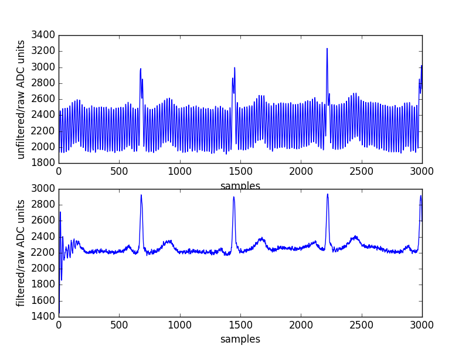

# iir_fixed_point



This is a compact fixed point 2nd order IIR filter implementation.

The data and coefficients are short int types and the accumulator
is of type int.

The coefficients need to be scaled up by 2^q and then the filter
scales its output back with a bitshift after every time step. q is the
last argument in the constructor. See the python script:
gen_coeff.py which generates the fixed point coefficients for our
bandstop.

## Useage

Just the header file 'DirectFormI.h' needs to be included in
your code. There are no library files to be included. The constructor
sets the coefficients (a_x are the feedback coefficients and b_x the
feedforward ones) and tells the filter the scaling factor 2^q of the
coefficients:
```
        b_0 + b_1 z^-1 + b_2 z^-2
H(z) = ---------------------------
        1 + a_1 z^-1 + a_2 z^-2
```

The filtering method is called "filter" which takes one
short int sample and outputs a short int sample and takes care
of the scaling.

## Demo

To run the demo which filters out 50Hz from an ECG:

```
make
./fixeddemo
python3 ./plot_ecg.py
```

Enjoy!

/Bernd Porr (mail@berndporr.me.uk)
